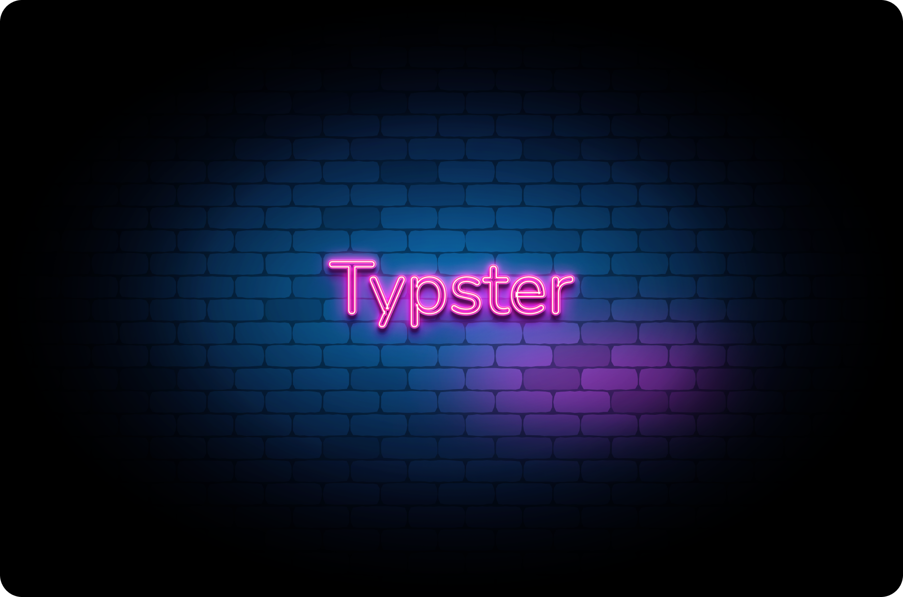

# ⌨️ Typster

 

> Typster is a simple typing game built using Desktop Compose. The game allows you to test your typing skills by typing a given text as fast and accurately as possible. You can also customize the text to your liking.

## 📺 Preview

## 🏃 Run
- Clone the repo and run `./gradlew run`

## 💡 Inspiration
- Inspired by the Typing game of Phoboslab

## 🛠 Built With
- [Kotlin](https://kotlinlang.org/) and [Desktop Compose](https://www.jetbrains.com/lp/compose-desktop/) - A declarative UI framework for building modern, responsive desktop applications using Kotlin.

## ✍️ Author

👤 **abhinav12k**

- Website: <a href="https://abhinav12k.github.io/" target="_blank">abhinav12k</a>
- LinkedIn: <a href="https://www.linkedin.com/in/abhinav12k/">abhinav12k</a>
- Email: abhi2000.rtk@gmail.com

Feel free to ping me 😉

## 🤝 Contributing

Contributions are what make the open source community such an amazing place to be learn, inspire, and create. Any contributions you make are **greatly appreciated**.

1. Open an issue first to discuss what you would like to change.
2. Fork the Project
3. Create your feature branch (`git checkout -b feature/amazing-feature`)
4. Commit your changes (`git commit -m 'Add some amazing feature'`)
5. Push to the branch (`git push origin feature/amazing-feature`)
6. Open a pull request

## ❤ Show your support

Give a ⭐️ if this project helped you!

## ☑️ TODO

- [ ] Scoreboard
- [x] WPM and accuracy calculator
- [ ] Set difficulty levels
- [ ] Typing mistakes sound and design
- [ ] Other alphabets and numbers support

## © 2023 Abhinav. All rights reserved.
